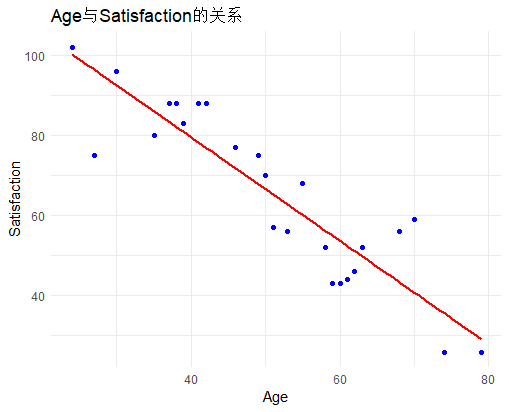
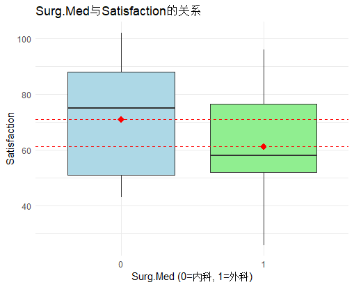
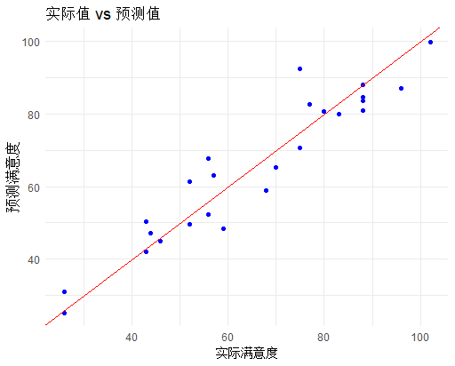

# 回归模型

## 一、问题概要
### 1.1 Mission:
>数据包括患者的年龄Age、疾病严重程度指数Severity（数值越高表示病情越严重）、一个表示患者是
内科患者（0）还是外科患者（1）的指示变量Surg-Med，以及焦虑指数Anxiety（数值越高表示焦虑
程度越高）
>使用以上随机变量作为自变量，对患者满意度（Satisfaction）拟合一个最优的多元线性回归模型。
希望你的工作能够根据患者的情况准确预估患者的满意度，便于医院采取一些措施（比如对潜在满意
度评分差的患者提供及时的咨询服务等方法）来提升医院整体的患者满意度。
### 1.2 Tasks:
>1. 使用描述统计学方法进行数据分析并给出适宜的结论
>2. 开展数据建模工作，展示寻找最优模型的方法及建模结果
>3. 对模型质量进行评估
>4. 对模型开展正确解读（影响因素分析）
>5. 模型可能存在的不足并给出优化建议


## 二、数据导入与处理
### 2.1 数据导入

将题目给出的数据使用excel制表，并另存为csv文件。

```r
dataset <- read.csv("data.csv")
```

### 2.2 数据处理
对于题目提供的数据，不难发现Surg-Med数据较为特殊，这是一个指示变量，0与1分别代表内科与外科，所以需要将其转换为因子型变量。

```r
dataset$Surg.Med <- as.factor(dataset$Surg.Med)
```

## 三、数据分析
进行数学建模之前，我们首先要看各个因素对于满意度的影响。

### 3.1 年龄对满意度的影响
在这里采用散点图的形式绘制年龄对满意度的影响，其中红线为拟合直线。

```r
# Age散点图
ggplot(dataset, aes(x = Age, y = Satisfaction)) +
  geom_point(color = "blue") +
  geom_smooth(method = "lm", se = FALSE, color = "red") +
  labs(title = "Age与Satisfaction的关系", x = "Age", y = "Satisfaction") +
  theme_minimal()
```



可以看到，随着年龄的增加，满意度越来越低，并且点的分布较为密集。

### 3.2 疾病严重程度对满意度的影响
在这里采用散点图的形式绘制疾病严重程度对满意度的影响，其中红线为拟合直线。

```r
# Severity散点图
ggplot(dataset, aes(x = Severity, y = Satisfaction)) +
  geom_point(color = "blue") +
  geom_smooth(method = "lm", se = FALSE, color = "red") +
  labs(title = "Severity与Satisfaction的关系", x = "Severity", y = "Satisfaction") +
  theme_minimal()
```


可以看到，随着疾病严重程度的增加，满意度越来越低，但是点的分布相较于年龄没有那么密集。

### 3.3 患者类型对满意度的影响
在这里采用箱型图的形式绘制患者类型对满意度的影响,其中红线为均值点。

```r
# Surg.Med箱线图
ggplot(dataset, aes(x = Surg.Med, y = Satisfaction)) +
  geom_boxplot(fill = c("lightblue", "lightgreen")) +
  stat_summary(fun = mean, geom = "point", shape = 18, size = 3, color = "red") + # 添加均值点
  stat_summary(fun = mean, geom = "hline", aes(yintercept = after_stat(y)), linetype = "dashed",
    color = "red") + # 添加均值水平线
  labs(title = "Surg.Med与Satisfaction的关系", 
       x = "Surg.Med (0=内科, 1=外科)", 
       y = "Satisfaction") +
  theme_minimal()
```



从中位数、均值以及两个百分位点均可以看出内科患者的满意度总体均高于外科患者，

### 3.4 焦虑指数对满意度的影响
在这里采用散点图的形式绘制焦虑指数对满意度的影响，其中红线为拟合直线。

```r
# Anxiety散点图
ggplot(dataset, aes(x = Anxiety, y = Satisfaction)) +
  geom_point(color = "blue") +
  geom_smooth(method = "lm", se = FALSE, color = "red") +
  labs(title = "Anxiety与Satisfaction的关系", x = "Anxiety", y = "Satisfaction") +
  theme_minimal()
```


可以看到，随着焦虑指数的增加，满意度越来越低，点的分布相较于年龄与疾病严重程度最为稀疏。

## 四、数学建模

### 4.1 线性回归
使用线性回归的方法进行数学建模，认为满意度是由年龄、疾病严重程度、患者类型、焦虑指数四个变量综合决定的，假设该数学模型为`Satisfactory=A·Age+B·Severity+C·Surg.Med+D·Anxiety+E`，使用R语言中的`lm`语句进行数学建模，并使用`summary`语句进行模型分析。

```r
model = lm(Satisfaction ~ Age + Severity + Surg.Med + Anxiety, data = dataset)
summary(model)
```

结果如下：
```r
> summary(model)

Call:
lm(formula = Satisfaction ~ Age + Severity + Surg.Med + Anxiety, 
    data = dataset)

Residuals:
     Min       1Q   Median       3Q      Max 
-18.1322  -3.5662   0.5655   4.7215  12.1448 

Coefficients:
            Estimate Std. Error t value Pr(>|t|)    
(Intercept) 143.8672     6.0437  23.804 3.80e-16 ***
Age          -1.1172     0.1383  -8.075 1.01e-07 ***
Severity     -0.5862     0.1356  -4.324 0.000329 ***
Surg.Med1     0.4149     3.0078   0.138 0.891672    
Anxiety       1.3064     1.0841   1.205 0.242246    
---
Signif. codes:  0 ‘***’ 0.001 ‘**’ 0.01 ‘*’ 0.05 ‘.’ 0.1 ‘ ’ 1

Residual standard error: 7.207 on 20 degrees of freedom
Multiple R-squared:  0.9036,	Adjusted R-squared:  0.8843 
F-statistic: 46.87 on 4 and 20 DF,  p-value: 6.951e-10
```

通过观察与分析模型各项参数，可以发现：
Age与Severity的P值远远小于0.05，是显著因素。
Surg.Med与Anxiety的P值都大于0.05，是非显著因素。
判断系数值为0.9036，矫正判断系数值为0.8843，说明模型的精准度较高。
该模型得出的结果为`Satisfactory=-1.1172·Age-0.5862·Severity+0.4149·Surg.Med+1.3064·Anxiety+143.8672`

### 4.2 模型优化
模型衡量指标可以判定模型精准度，计算公式为`AIC=2k-2ln(L)`，其中k是模型参数数量，L是对数似然函数值。
AIC值越低，模型精准度越高。
通过`step`函数对`model`进行优化，筛去能使AIC值降低的值。

```r
step_model=step(model)
summary(step_model)
```

结果如下：
```r
> step_model=step(model)
Start:  AIC=103.18
Satisfaction ~ Age + Severity + Surg.Med + Anxiety

           Df Sum of Sq    RSS    AIC
- Surg.Med  1       1.0 1039.9 101.20
- Anxiety   1      75.4 1114.4 102.93
<none>                  1038.9 103.18
- Severity  1     971.5 2010.4 117.68
- Age       1    3387.7 4426.6 137.41

Step:  AIC=101.2
Satisfaction ~ Age + Severity + Anxiety

           Df Sum of Sq    RSS    AIC
- Anxiety   1      74.6 1114.5 100.93
<none>                  1039.9 101.20
- Severity  1     971.8 2011.8 115.70
- Age       1    3492.7 4532.6 136.00

Step:  AIC=100.93
Satisfaction ~ Age + Severity

           Df Sum of Sq    RSS    AIC
<none>                  1114.5 100.93
- Severity  1     907.0 2021.6 113.82
- Age       1    4029.4 5143.9 137.17
> summary(step_model)

Call:
lm(formula = Satisfaction ~ Age + Severity, data = dataset)

Residuals:
     Min       1Q   Median       3Q      Max 
-17.2800  -5.0316   0.9276   4.2911  10.4993 

Coefficients:
            Estimate Std. Error t value Pr(>|t|)    
(Intercept) 143.4720     5.9548  24.093  < 2e-16 ***
Age          -1.0311     0.1156  -8.918 9.28e-09 ***
Severity     -0.5560     0.1314  -4.231 0.000343 ***
---
Signif. codes:  0 ‘***’ 0.001 ‘**’ 0.01 ‘*’ 0.05 ‘.’ 0.1 ‘ ’ 1

Residual standard error: 7.118 on 22 degrees of freedom
Multiple R-squared:  0.8966,	Adjusted R-squared:  0.8872 
F-statistic: 95.38 on 2 and 22 DF,  p-value: 1.446e-11
```
可以看到，删去Surg.Med与Anxiety均会使AIC值降低，优化后的`step_model`中,矫正判断系数值为0.8872,相比优化前的0.8843更加高，说明模型精准度得到的提升。
该模型得出的结果为`Satisfactory=-1.0311·Age-0.5560·Severity+143.4720`

## 五、模型测试
得出模型后，需要对模型进行测试，以此来直观地体会模型准确度。
### 5.1 残差分布
绘制模型残差图，观察误差。
```r
plot(residuals(step_model), main = "残差分布")   # 残差分布图
abline(h = 0, col = "red")
```

可以看到，残差分布在0左右，没有明显趋势，模型准确性尚可。

### 5.2 预测值与实际值比较

通过将已有数据再次导入模型，得到预测值，并绘图与实际值比较。

```r
dataset$predicted <- predict(step_model)

ggplot(dataset, aes(x = Satisfaction, y = predicted)) +
  geom_point(color = "blue") +
  geom_abline(slope = 1, intercept = 0, col = "red") +
  labs(title = "实际值 vs 预测值", x = "实际满意度", y = "预测满意度")+
  theme_minimal()
```



红线为`y=x`直线，可以看到蓝点均分布在红线周围，说明预测值与实际值相近，模型具有较高准确性。

## 六、潜在问题与优化建议
通过建模、优化、测试，可以发现得出的模型精度较高，但是还没有达到极高的水准，在残差测试上仍有欠缺，通过分析比较过程与结果，我们得出了以下问题：
- 通过`step`方法优化后的模型直接删去了Surg.Med与Anxiety两个因素，虽然使得AIC降低，但是可能不符合实际情况，还有可能有其他的影响因素，这一点可能需要通过实际调查后才能知道。
- 数据量太少，只有仅仅25条，应当增加数据量，来获得更加准确的模型。
- 使用得出模型的数据来进行测试，会让模型测试得到的精准度偏高，应当使用其他数据进行测试，但是本题目中的数据量不支持这么做。


## 七、结论
- 医院应当对于更加年长或病情更加严重的患者更加关心，以此来提高他们的满意度。
- 患者种类与他们的焦虑指数虽然对满意度的影响不显著，但是出于人道主义的角度，应当时刻观察患者的焦虑指数并及时提供心理治疗。