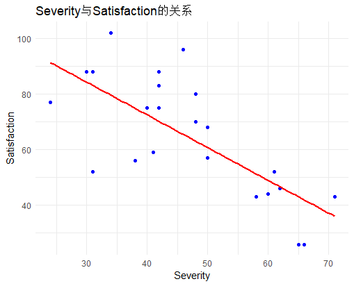
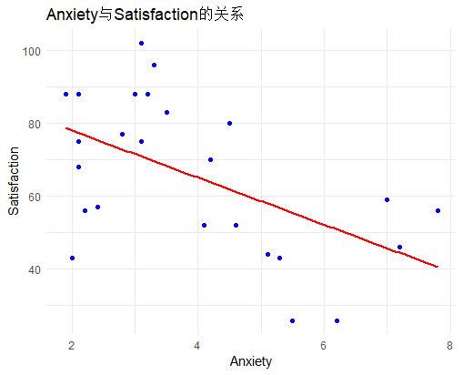
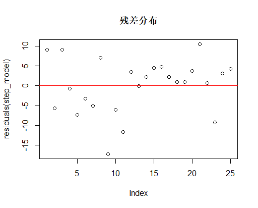
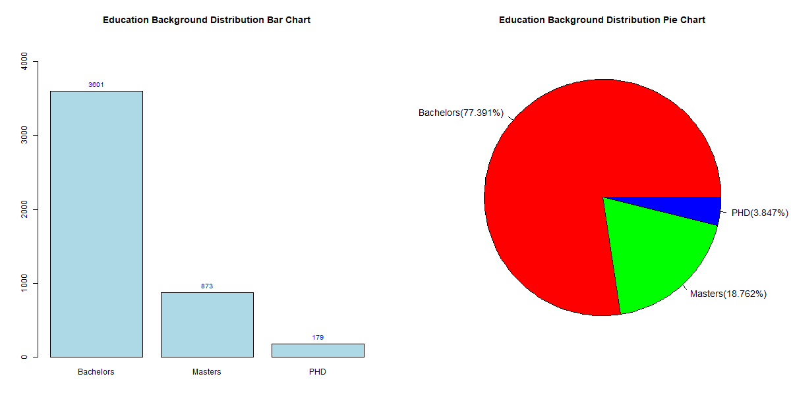

# 统计分析与建模期末项目

## 小组成员
- 2253984施帅乾
- 2253909张宏晔
- 2250821郭平伟

---

# 回归模型

## 一、问题概要
### 1.1 Mission:
>数据包括患者的年龄Age、疾病严重程度指数Severity（数值越高表示病情越严重）、一个表示患者是
内科患者（0）还是外科患者（1）的指示变量Surg-Med，以及焦虑指数Anxiety（数值越高表示焦虑
程度越高）
>使用以上随机变量作为自变量，对患者满意度（Satisfaction）拟合一个最优的多元线性回归模型。
希望你的工作能够根据患者的情况准确预估患者的满意度，便于医院采取一些措施（比如对潜在满意
度评分差的患者提供及时的咨询服务等方法）来提升医院整体的患者满意度。
### 1.2 Tasks:
>1. 使用描述统计学方法进行数据分析并给出适宜的结论
>2. 开展数据建模工作，展示寻找最优模型的方法及建模结果
>3. 对模型质量进行评估
>4. 对模型开展正确解读（影响因素分析）
>5. 模型可能存在的不足并给出优化建议


## 二、数据导入与处理
### 2.1 数据导入

将题目给出的数据使用excel制表，并另存为csv文件。

```r
dataset <- read.csv("data.csv")
```

### 2.2 数据处理
对于题目提供的数据，不难发现Surg-Med数据较为特殊，这是一个指示变量，0与1分别代表内科与外科，所以需要将其转换为因子型变量。

```r
dataset$Surg.Med <- as.factor(dataset$Surg.Med)
```

## 三、数据分析
进行数学建模之前，我们首先要看各个因素对于满意度的影响。

### 3.1 年龄对满意度的影响
在这里采用散点图的形式绘制年龄对满意度的影响，其中红线为拟合直线。

```r
# Age散点图
ggplot(dataset, aes(x = Age, y = Satisfaction)) +
  geom_point(color = "blue") +
  geom_smooth(method = "lm", se = FALSE, color = "red") +
  labs(title = "Age与Satisfaction的关系", x = "Age", y = "Satisfaction") +
  theme_minimal()
```


可以看到，随着年龄的增加，满意度越来越低，并且点的分布较为密集。

### 3.2 疾病严重程度对满意度的影响
在这里采用散点图的形式绘制疾病严重程度对满意度的影响，其中红线为拟合直线。

```r
# Severity散点图
ggplot(dataset, aes(x = Severity, y = Satisfaction)) +
  geom_point(color = "blue") +
  geom_smooth(method = "lm", se = FALSE, color = "red") +
  labs(title = "Severity与Satisfaction的关系", x = "Severity", y = "Satisfaction") +
  theme_minimal()
```




可以看到，随着疾病严重程度的增加，满意度越来越低，但是点的分布相较于年龄没有那么密集。

### 3.3 患者类型对满意度的影响
在这里采用箱型图的形式绘制患者类型对满意度的影响,其中红线为均值点。

```r
# Surg.Med箱线图
ggplot(dataset, aes(x = Surg.Med, y = Satisfaction)) +
  geom_boxplot(fill = c("lightblue", "lightgreen")) +
  stat_summary(fun = mean, geom = "point", shape = 18, size = 3, color = "red") + # 添加均值点
  stat_summary(fun = mean, geom = "hline", aes(yintercept = after_stat(y)), linetype = "dashed",
    color = "red") + # 添加均值水平线
  labs(title = "Surg.Med与Satisfaction的关系", 
       x = "Surg.Med (0=内科, 1=外科)", 
       y = "Satisfaction") +
  theme_minimal()
```


从中位数、均值以及两个百分位点均可以看出内科患者的满意度总体均高于外科患者，

### 3.4 焦虑指数对满意度的影响
在这里采用散点图的形式绘制焦虑指数对满意度的影响，其中红线为拟合直线。

```r
# Anxiety散点图
ggplot(dataset, aes(x = Anxiety, y = Satisfaction)) +
  geom_point(color = "blue") +
  geom_smooth(method = "lm", se = FALSE, color = "red") +
  labs(title = "Anxiety与Satisfaction的关系", x = "Anxiety", y = "Satisfaction") +
  theme_minimal()
```





可以看到，随着焦虑指数的增加，满意度越来越低，点的分布相较于年龄与疾病严重程度最为稀疏。

## 四、数学建模

### 4.1 线性回归
使用线性回归的方法进行数学建模，认为满意度是由年龄、疾病严重程度、患者类型、焦虑指数四个变量综合决定的，假设该数学模型为`Satisfactory=A·Age+B·Severity+C·Surg.Med+D·Anxiety+E`，使用R语言中的`lm`语句进行数学建模，并使用`summary`语句进行模型分析。

```r
model = lm(Satisfaction ~ Age + Severity + Surg.Med + Anxiety, data = dataset)
summary(model)
```

结果如下：
```r
> summary(model)

Call:
lm(formula = Satisfaction ~ Age + Severity + Surg.Med + Anxiety, 
    data = dataset)

Residuals:
     Min       1Q   Median       3Q      Max 
-18.1322  -3.5662   0.5655   4.7215  12.1448 

Coefficients:
            Estimate Std. Error t value Pr(>|t|)    
(Intercept) 143.8672     6.0437  23.804 3.80e-16 ***
Age          -1.1172     0.1383  -8.075 1.01e-07 ***
Severity     -0.5862     0.1356  -4.324 0.000329 ***
Surg.Med1     0.4149     3.0078   0.138 0.891672    
Anxiety       1.3064     1.0841   1.205 0.242246    
---
Signif. codes:  0 ‘***’ 0.001 ‘**’ 0.01 ‘*’ 0.05 ‘.’ 0.1 ‘ ’ 1

Residual standard error: 7.207 on 20 degrees of freedom
Multiple R-squared:  0.9036,	Adjusted R-squared:  0.8843 
F-statistic: 46.87 on 4 and 20 DF,  p-value: 6.951e-10
```

通过观察与分析模型各项参数，可以发现：
Age与Severity的P值远远小于0.05，是显著因素。
Surg.Med与Anxiety的P值都大于0.05，是非显著因素。
判断系数值为0.9036，矫正判断系数值为0.8843，说明模型的精准度较高。
该模型得出的结果为`Satisfactory=-1.1172·Age-0.5862·Severity+0.4149·Surg.Med+1.3064·Anxiety+143.8672`

### 4.2 模型优化
模型衡量指标可以判定模型精准度，计算公式为`AIC=2k-2ln(L)`，其中k是模型参数数量，L是对数似然函数值。
AIC值越低，模型精准度越高。
通过`step`函数对`model`进行优化，筛去能使AIC值降低的值。

```r
step_model=step(model)
summary(step_model)
```

结果如下：
```r
> step_model=step(model)
Start:  AIC=103.18
Satisfaction ~ Age + Severity + Surg.Med + Anxiety

           Df Sum of Sq    RSS    AIC
- Surg.Med  1       1.0 1039.9 101.20
- Anxiety   1      75.4 1114.4 102.93
<none>                  1038.9 103.18
- Severity  1     971.5 2010.4 117.68
- Age       1    3387.7 4426.6 137.41

Step:  AIC=101.2
Satisfaction ~ Age + Severity + Anxiety

           Df Sum of Sq    RSS    AIC
- Anxiety   1      74.6 1114.5 100.93
<none>                  1039.9 101.20
- Severity  1     971.8 2011.8 115.70
- Age       1    3492.7 4532.6 136.00

Step:  AIC=100.93
Satisfaction ~ Age + Severity

           Df Sum of Sq    RSS    AIC
<none>                  1114.5 100.93
- Severity  1     907.0 2021.6 113.82
- Age       1    4029.4 5143.9 137.17
> summary(step_model)

Call:
lm(formula = Satisfaction ~ Age + Severity, data = dataset)

Residuals:
     Min       1Q   Median       3Q      Max 
-17.2800  -5.0316   0.9276   4.2911  10.4993 

Coefficients:
            Estimate Std. Error t value Pr(>|t|)    
(Intercept) 143.4720     5.9548  24.093  < 2e-16 ***
Age          -1.0311     0.1156  -8.918 9.28e-09 ***
Severity     -0.5560     0.1314  -4.231 0.000343 ***
---
Signif. codes:  0 ‘***’ 0.001 ‘**’ 0.01 ‘*’ 0.05 ‘.’ 0.1 ‘ ’ 1

Residual standard error: 7.118 on 22 degrees of freedom
Multiple R-squared:  0.8966,	Adjusted R-squared:  0.8872 
F-statistic: 95.38 on 2 and 22 DF,  p-value: 1.446e-11
```
可以看到，删去Surg.Med与Anxiety均会使AIC值降低，优化后的`step_model`中,矫正判断系数值为0.8872,相比优化前的0.8843更加高，说明模型精准度得到的提升。
该模型得出的结果为`Satisfactory=-1.0311·Age-0.5560·Severity+143.4720`

## 五、模型测试
得出模型后，需要对模型进行测试，以此来直观地体会模型准确度。
### 5.1 残差分布
绘制模型残差图，观察误差。
```r
plot(residuals(step_model), main = "残差分布")   # 残差分布图
abline(h = 0, col = "red")
```



可以看到，残差分布在0左右，没有明显趋势，模型准确性尚可。

### 5.2 预测值与实际值比较

通过将已有数据再次导入模型，得到预测值，并绘图与实际值比较。

```r
dataset$predicted <- predict(step_model)

ggplot(dataset, aes(x = Satisfaction, y = predicted)) +
  geom_point(color = "blue") +
  geom_abline(slope = 1, intercept = 0, col = "red") +
  labs(title = "实际值 vs 预测值", x = "实际满意度", y = "预测满意度")+
  theme_minimal()
```


红线为`y=x`直线，可以看到蓝点均分布在红线周围，说明预测值与实际值相近，模型具有较高准确性。

## 六、潜在问题与优化建议
通过建模、优化、测试，可以发现得出的模型精度较高，但是还没有达到极高的水准，在残差测试上仍有欠缺，通过分析比较过程与结果，我们得出了以下问题：
- 通过`step`方法优化后的模型直接删去了Surg.Med与Anxiety两个因素，虽然使得AIC降低，但是可能不符合实际情况，还有可能有其他的影响因素，这一点可能需要通过实际调查后才能知道。
- 数据量太少，只有仅仅25条，应当增加数据量，来获得更加准确的模型。
- 使用得出模型的数据来进行测试，会让模型测试得到的精准度偏高，应当使用其他数据进行测试，但是本题目中的数据量不支持这么做。


## 七、结论
- 医院应当对于更加年长或病情更加严重的患者更加关心，以此来提高他们的满意度。
- 患者种类与他们的焦虑指数虽然对满意度的影响不显著，但是出于人道主义的角度，应当时刻观察患者的焦虑指数并及时提供心理治疗。

---

## 2.分类模型


### 1.请进行相应的数据分析，并回答以下问题：

#### （1）不同员工的学历分布是怎样的？

学历分布如下图所示



具体流程如下：

1. 首先读取数据，使用 `read.csv()` 方法读取员工数据文件 `employee.csv`

    ```r
    employee_data <- read.csv("employee.csv")
    ```

2. 然后对数据进行清洗，去除`Education`列数据缺失的行（经过统计，发现数据中无缺失值，因此在已知此条件的情况下，该步骤可以省略）

    ```r
    employee_data <- employee_data[!is.na(employee_data$Education), ]
    ```

3. 接下来就可以得到各个学历的分布，进而求出比例（比例保留三位小数），并设置对应的图例标签

    ```r
    education_distribution <- table(employee_data$Education)
    education_proportions <- round(education_distribution / sum(education_distribution) * 100, 3)
    labels_with_proportions <- paste(names(education_distribution), "(", education_proportions, "%)", sep = "")
    ```

4. 绘制图表，在一张横向布局的图中分别画出学历分布的柱状图和饼状图，柱状图可以直观显示各个学历的数量，而饼状图可以直观显示各个学历的占比

   ```r
   par(mfrow = c(1, 2), mar = c(4, 4, 4, 2))  
   
   # 柱状图
   barplot_heights <- barplot(education_distribution,
                              main = "Education Background Distribution Barplot",
                              col = "lightblue", ylim = c(0, max(education_distribution) * 1.2))
   text(x = barplot_heights,
        y = education_distribution,
        labels = education_distribution,
        pos = 3, cex = 0.8, col = "blue")
   
   # 饼状图
   pie(education_distribution,
       main = "Education Background Distribution Pie Chart",
       labels = labels_with_proportions,
       col = rainbow(length(education_distribution)),
       cex = 1.2)
   ```

#### （2）不同城市的员⼯服务年限有何差异？差异是否显著？

不同城市的员工服务年限有显著差异，且差异十分显著，具体分析过程如下：

1. 首先读取数据，使用 `read.csv()` 方法读取员工数据文件 `employee.csv`
    ```r
    employee_data <- read.csv("employee.csv")
    ```

2. 然后对数据进行操作，确保`JoiningYear`列，并且过滤掉缺失值和不合理的年份

    ```r
    employee_data$JoiningYear <- as.numeric(as.character(employee_data$JoiningYear))
    employee_data <- subset(employee_data, !is.na(JoiningYear) & JoiningYear <= 2024)
    ```

3. 接下来就可以得到各个员工服务年限的数据了

    ```r
    employee_data$ServiceYears <- 2024 - employee_data$JoiningYear
    ```

4. 根据不同城市的员⼯服务年限画出箱线图

   ```r
   boxplot(ServiceYears ~ City, data = employee_data, main = "Service Years by City", col = "lightgreen")
   ```

   

​		从箱线图中是可以看出不同城市的员⼯服务年限是有明显差异的，但我们还可以进行方差分析来进一步确定

5. 进行方差分析

   ```r
   anova_result <- aov(ServiceYears ~ City, data = employee_data)
   summary(anova_result)
   ```

   得到如下结果

   ```shell
                 Df Sum Sq Mean Sq F value Pr(>F)
   City           2    341   170.4   50.12 <2e-16 ***
   Residuals   4650  15812     3.4
   ---
   Signif. codes:  0 '***' 0.001 '**' 0.01 '*' 0.05 '.' 0.1 ' ' 1
   ```

   可以看出，Pr值 < `2e-16`，这个值远小于0.05，因此我们可以认为不同城市的员工服务年限有显著差异，且差异十分显著

#### （3）薪资等级与当前领域经验之间是否存在某种关联？

薪资等级与当前领域经验之间并不存在某种关联，具体分析过程如下：

1. 首先读取数据，使用 `read.csv()` 方法读取员工数据文件 `employee.csv`
    ```r
    employee_data <- read.csv("employee.csv")
    ```

2. 然后对数据进行操作，删除` PaymentTier` 或 `ExperienceInCurrentDomain `列中有缺失值的行（经过统计，发现数据中无缺失值，因此在已知此条件的情况下，该步骤可以省略）

    ```r
    employee_data$JoiningYear <- as.numeric(as.character(employee_data$JoiningYear))
    employee_data <- subset(employee_data, !is.na(JoiningYear) & JoiningYear <= 2024)
    ```

3. 假设薪资等级与当前领域经验之间存在某种关联，进行卡方检验

    ```r
    contingency_table_raw <- table(employee_data$PaymentTier, employee_data$ExperienceInCurrentDomain)
    chi_test_raw <- chisq.test(contingency_table_raw)
    print(chi_test_raw)
    ```

    得到如下结果

    ```r
    
            Pearson's Chi-squared test
    
    data:  contingency_table_raw
    X-squared = 20.106, df = 14, p-value = 0.1268
    
    Warning message:
    In chisq.test(contingency_table_raw) : Chi-squared近似算法有可能不准
    
    ```

    可以看到p值为0.1268，大于0.05，但是有Chi-squared近似算法有可能不准的提示，这是因为有些数据的频次小于5

4. 为了解决上述问题，查看哪些数据的频次小于5

   ```r
   contingency_table_raw <- table(employee_data$PaymentTier, employee_data$ExperienceInCurrentDomain)
   print(contingency_table_raw)
   ```

   得到如下结果

   ```shell
      
         0   1   2   3   4   5   6   7
     1  25  36  51  41  43  45   1   1
     2  66  90 252 150 184 174   1   1
     3 264 432 784 595 704 700   6   7
   ```

   因此考虑将同一薪资等级的当前领域年份大于4的数据合并

5. 将同一薪资等级的当前领域年份大于4的数据合并

    ```r
    employee_data$ExperienceInCurrentDomain <- as.numeric(as.character(employee_data$ExperienceInCurrentDomain))
    employee_data$ExperienceGroup <- cut(employee_data$ExperienceInCurrentDomain,
                                          breaks = c(-Inf, 0, 1, 2, 3, 4, Inf),
                                          labels = c("0 years", "1 year", "2 years", "3 years", "4 years", "4+years"))
    ```
    
 6. 对合并后的数据在进行卡方检验
    
    ```r
       contingency_table_merged <- table(employee_data$PaymentTier, employee_data$ExperienceGroup)
       chi_test_merged <- chisq.test(contingency_table_merged)
       print(chi_test_merged)
    ```
      得到如下结果：
    
    ```shell
       
               Pearson's Chi-squared test
       
       data:  contingency_table_merged
       X-squared = 18.139, df = 10, p-value = 0.05267
       
    ```
    可以看到p值为0.05267，大于0.05，因此可以认为薪资等级与当前领域经验之间并不存在某种关联

### 2.请通过构建⻉叶斯⽹络预测员⼯是否会离职，评估模型质量

1. 首先读取数据，使用 `read.csv()` 方法读取员工数据文件 `employee.csv`

   ```r
   employee_data <- read.csv("employee.csv")
   ```

2. 对数据进行处理，删除包含缺失值的行（经计算，`sum(is.na(employee_data)`为0），然后将每列数据都转为因子型

   ```R
   if (sum(is.na(employee_data)) > 0) {
     employee_data <- na.omit(employee_data)
   }
   employee_data <- as.data.frame(lapply(employee_data, factor))
   ```

3. 导入`bnlearn`包，构建并训练贝叶斯网络

   ```r
   bn_structure <- hc(employee_data)
   bn_model <- bn.fit(bn_structure, data = employee_data)
   ```

4. 对模型进行预测，并通过计算准确率、精确率、召回率、`F1-Score`，对模型质量进行评估

   ```r
   predicted <- predict(bn_model, node = "LeaveOrNot", data = employee_data)
   conf_matrix <- table(predicted, employee_data$LeaveOrNot)
   accuracy <- sum(diag(conf_matrix)) / sum(conf_matrix)
   precision <- conf_matrix[2,2] / sum(conf_matrix[2,])
   recall <- conf_matrix[2,2] / sum(conf_matrix[,2])
   f1_score <- 2 * (precision * recall) / (precision + recall)
   print(paste("Accuracy:", accuracy))
   print(paste("Precision:", precision))
   print(paste("Recall:", recall))
   print(paste("F1-Score:", f1_score))
   ```

   得到如下结果

   ```r
   [1] "Accuracy: 0.809800128949065"
   [1] "Precision: 0.890710382513661"
   [1] "Recall: 0.509375"
   [1] "F1-Score: 0.648111332007952"
   ```

5. 对结果进行分析

   1. 准确率（模型预测正确的样本占总样本的比例）：0.8098
      - 准确率较高，说明模型总体上能够较好地区分正类和负类
      - 当数据集中类别不平衡时（例如，正类样本明显少于负类），高准确率可能会掩盖模型对少数类的表现不佳
   2. 精确率（在所有被预测为正类的样本中，实际为正类的比例）：0.8907
      - 精确率很高（接近 90%），说明模型预测为正类时大多数是正确的，这意味着误报率较低
   3. 召回率（在所有实际为正类的样本中，被模型正确预测为正类的比例）：0.5094
      - 召回率较低（约 51%），表明模型漏报了许多正类样本
   4. `F1-Score`（Precision 和 Recall 的加权调和平均值，用于平衡两者的表现）：0.6481
      - `F1-Score `中等（约 0.65），表明模型在精确率和召回率之间存在一定的权衡
      - 虽然模型的精确率较高，但召回率相对较低，整体性能较为平衡，但仍有改进空间

   总而言之，模型其总体上能够较好地区分正类和负类。然而，在类别不平衡的情况下，高准确率可能掩盖了模型对少数类的表现。精确率很高，模型预测为正类时大多数是正确的，误报率较低。但是召回率较低，模型漏报了许多正类样本。模型在精确率和召回率之间存在一定的权衡。尽管精确率较高，召回率偏低，整体表现平衡，但仍有改进空间。

### 3.请构建逻辑回归模型对员⼯是否会离职进⾏预测，并通过模型解读员⼯离职的影响因素

1. 首先读取数据，使用 `read.csv()` 方法读取员工数据文件 `employee.csv`

   ```r
   employee_data <- read.csv("employee.csv")
   ```

2. 对数据进行处理，删除包含缺失值的行（经计算，`sum(is.na(employee_data)`为0），然后将每列数据都转为因子型

   ```R
   if (sum(is.na(employee_data)) > 0) {
     employee_data <- na.omit(employee_data)
   }
   employee_data <- as.data.frame(lapply(employee_data, factor))
   ```

3. 导入必要的包，并划分训练集和测试集（80%训练，20%测试）

   ```r
   trainIndex <- createDataPartition(employee_data$LeaveOrNot, p = 0.8, list = FALSE)
   train_data <- employee_data[trainIndex, ]
   test_data <- employee_data[-trainIndex, ]
   ```

4. 构建逻辑回归模型，并查看模型总结

   ```r
   logit_model <- glm(LeaveOrNot ~ Education + City + PaymentTier + Gender + EverBenched + ExperienceInCurrentDomain + JoiningYear + Age,
                      data = train_data, 
                      family = binomial(link = "logit"))
   summary(logit_model)
   ```

   得到如下结果：

   ```r
   Call:
   glm(formula = LeaveOrNot ~ Education + City + PaymentTier + Gender + 
       EverBenched + ExperienceInCurrentDomain + JoiningYear + Age, 
       family = binomial(link = "logit"), data = train_data)
   
   Coefficients:
                               Estimate Std. Error z value Pr(>|z|)    
   (Intercept)                 0.102617   0.425425   0.241 0.809392    
   EducationMasters            1.144595   0.123385   9.277  < 2e-16 ***
   EducationPHD               -1.066426   0.323185  -3.300 0.000968 ***
   CityNew Delhi              -0.487141   0.128292  -3.797 0.000146 ***
   CityPune                    0.606177   0.110603   5.481 4.24e-08 ***
   PaymentTier2                0.981385   0.199376   4.922 8.55e-07 ***
   PaymentTier3               -0.601452   0.178663  -3.366 0.000762 ***
   GenderMale                 -0.994731   0.091543 -10.866  < 2e-16 ***
   EverBenchedYes              0.255723   0.144750   1.767 0.077287 .
   ExperienceInCurrentDomain1 -0.009854   0.213850  -0.046 0.963246
   ExperienceInCurrentDomain2 -0.358030   0.208030  -1.721 0.085241 .
   ExperienceInCurrentDomain3  0.032920   0.231086   0.142 0.886719
   ExperienceInCurrentDomain4 -0.521484   0.252524  -2.065 0.038914 *
   ExperienceInCurrentDomain5 -0.832759   0.267558  -3.112 0.001855 ** 
   ExperienceInCurrentDomain6 -2.551136   2.088323  -1.222 0.221852
   ExperienceInCurrentDomain7  0.733272   0.928533   0.790 0.429697
   JoiningYear2013             0.449043   0.166757   2.693 0.007086 **
   JoiningYear2014             0.175504   0.169352   1.036 0.300048
   JoiningYear2015             0.235935   0.167072   1.412 0.157897
   JoiningYear2016             0.050241   0.183823   0.273 0.784612
   JoiningYear2017            -0.712867   0.174272  -4.091 4.30e-05 ***
   JoiningYear2018             6.434689   0.610593  10.538  < 2e-16 ***
   Age23                      -0.487889   0.597928  -0.816 0.414520
   Age24                       0.061193   0.445856   0.137 0.890835
   Age25                      -0.144825   0.454882  -0.318 0.750198
   Age26                      -0.087528   0.461846  -0.190 0.849687
   Age27                       0.375102   0.469741   0.799 0.424564
   Age28                      -0.657715   0.421360  -1.561 0.118539
   Age29                      -0.540246   0.451182  -1.197 0.231150
   Age30                      -0.437794   0.444792  -0.984 0.324984
   Age31                      -0.460702   0.478979  -0.962 0.336130
   Age32                       0.031594   0.469366   0.067 0.946334
   Age33                      -0.440314   0.494708  -0.890 0.373441    
   Age34                      -0.281716   0.481853  -0.585 0.558782
   Age35                      -0.676773   0.504409  -1.342 0.179688
   Age36                      -0.723042   0.470903  -1.535 0.124676
   Age37                      -0.580487   0.476005  -1.219 0.222655    
   Age38                      -0.227333   0.474435  -0.479 0.631821
   Age39                      -0.746710   0.487989  -1.530 0.125973
   Age40                      -0.798218   0.490391  -1.628 0.103584
   Age41                      -0.201725   0.514883  -0.392 0.695214
   ---
   Signif. codes:  0 '***' 0.001 '**' 0.01 '*' 0.05 '.' 0.1 ' ' 1
   
   (Dispersion parameter for binomial family taken to be 1)
   
       Null deviance: 4791.7  on 3722  degrees of freedom
   Residual deviance: 3310.0  on 3682  degrees of freedom
   AIC: 3392
   
   Number of Fisher Scoring iterations: 7
   ```

   对上述数据分析，可以得知员工离职的影响因素，但在分析之前，还需要先查看下准确率

5. 计算并输出准确率

   ```r
   train_pred_prob <- predict(logit_model, train_data, type = "response")
   test_pred_prob <- predict(logit_model, test_data, type = "response")
   train_pred_class <- ifelse(train_pred_prob > 0.5, 1, 0)
   test_pred_class <- ifelse(test_pred_prob > 0.5, 1, 0)
   train_conf_matrix <- table(Predicted = train_pred_class, Actual = train_data$LeaveOrNot)
   train_accuracy <- sum(diag(train_conf_matrix)) / sum(train_conf_matrix)
   train_precision <- train_conf_matrix[2,2] / sum(train_conf_matrix[2,])
   train_recall <- train_conf_matrix[2,2] / sum(train_conf_matrix[,2])
   train_f1 <- 2 * (train_precision * train_recall) / (train_precision + train_recall)
   test_conf_matrix <- table(Predicted = test_pred_class, Actual = test_data$LeaveOrNot)
   test_accuracy <- sum(diag(test_conf_matrix)) / sum(test_conf_matrix)
   test_precision <- test_conf_matrix[2,2] / sum(test_conf_matrix[2,])
   test_recall <- test_conf_matrix[2,2] / sum(test_conf_matrix[,2])
   test_f1 <- 2 * (test_precision * test_recall) / (test_precision + test_recall)
   cat("训练集准确率:", train_accuracy, "\n")
   cat("训练集精确率:", train_precision, "\n")
   cat("训练集召回率:", train_recall, "\n")
   cat("训练集F1分数:", train_f1, "\n")
   cat("测试集准确率:", test_accuracy, "\n")
   cat("测试集精确率:", test_precision, "\n")
   cat("测试集召回率:", test_recall, "\n")
   cat("测试集F1分数:", test_f1, "\n")
   ```

   得到如下结果

   ```r
   训练集准确率: 0.8119796 
   训练集精确率: 0.8152174 
   训练集召回率: 0.5859375
   训练集F1分数: 0.6818182
   测试集准确率: 0.7892473
   测试集精确率: 0.7627119
   测试集召回率: 0.5625
   测试集F1分数: 0.647482
   ```

   可以看出虽然召回率稍微有些低，但是由于模型准确率、精确率都比较高，因此可以认为模型能够较好地区分正类和负类，因此我们通过模型解读员工离职的影响因素是合理的

6. 对模型总结结果进行分析，解读员工离职的影响因素：

   1. Education (学历)

      ```r
      EducationMasters            1.144595   0.123385   9.277  < 2e-16 ***
      EducationPHD               -1.066426   0.323185  -3.300 0.000968 ***
      ```

      - `EducationMasters`的Pr值 < `2e-16`，远小于0.001，且系数为正数，说明硕士学历的员工比非硕士学历的员工离职的可能性更高，且极为显著
      - `EducationPHD`的Pr值为0.000968，小于0.001，且系数为负数，说明博士学历的员工比非博士学历的员工离职的可能性更低，且十分显著

   2. City（城市）

      ```r
      CityNew Delhi              -0.487141   0.128292  -3.797 0.000146 ***
      CityPune                    0.606177   0.110603   5.481 4.24e-08 ***
      ```

      - `CityNew Delhi`的Pr值为0.000146，小于0.001，且系数为负数，说明在`New Delhi`的员工比其他城市的员工离职的可能性更低，且十分显著
      - `CityPune `的Pr值为`4.24e-08`，远小于0.001，且系数为正数，说明在`Pune`的员工比其他城市的员工离职的可能性更高，且极为显著

   3. `PaymentTier` (薪资等级)

      ```r
      PaymentTier2                0.981385   0.199376   4.922 8.55e-07 ***
      PaymentTier3               -0.601452   0.178663  -3.366 0.000762 ***
      ```

      - `PaymentTier2`的Pr值为`8.55e-07`，远小于0.001，且系数为正数，说明薪资等级为2的员工比其他薪资等级的员工离职的可能性更高，且极为显著
      - `PaymentTier3   `的Pr值为0.000762，小于0.001，且系数为负数，说明薪资等级为3的员工比其他薪资等级的员工离职的可能性更低，且十分显著

   4. Gender（性别认同）

      ```R
      GenderMale                 -0.994731   0.091543 -10.866  < 2e-16 ***
      ```

      - `GenderMale`的Pr值Pr值 < `2e-16`，远小于0.001，且系数为负数，说明性别认同为男性员工比非男性员工离职的可能性更低，且极为显著

   5. `EverBenched`（是否曾有过未被分配⼯作的临时状态）

      ```r
      EverBenchedYes              0.255723   0.144750   1.767 0.077287 .
      ```

      - `EverBenchedYes`的Pr值为0.078，接近0.05，且系数为正数，说明有过未被分配⼯作的临时状态的员工比没有过的员工离职的可能性更高，但不显著

   6. `ExperienceInCurrentDomain` (当前领域工作年数)

      ```r
      ExperienceInCurrentDomain2 -0.358030   0.208030  -1.721 0.085241 .
      ExperienceInCurrentDomain4 -0.521484   0.252524  -2.065 0.038914 *
      ExperienceInCurrentDomain5 -0.832759   0.267558  -3.112 0.001855 ** 
      ```

      - `ExperienceInCurrentDomain2`的Pr值为为0.085，接近0.05，且系数为负数，说明当前领域工作年数为2的员工比其他当前领域工作年数的员工离职的可能性更低，但不显著
      - `ExperienceInCurrentDomain4   `的Pr值为0.038914，小于0.05，且系数为负数，说明当前领域工作年数为4的员工比其他当前领域工作年数的员工离职的可能性更低，且显著
      - `ExperienceInCurrentDomain5   `的Pr值为0.001855，小于0.05，且系数为负数，说明当前领域工作年数为5的员工比其他当前领域工作年数的员工离职的可能性更低，且更显著

   7. `JoiningYear` (加入年份)

      ```R
      JoiningYear2013             0.449043   0.166757   2.693 0.007086 **
      JoiningYear2017            -0.712867   0.174272  -4.091 4.30e-05 ***
      JoiningYear2018             6.434689   0.610593  10.538  < 2e-16 ***
      ```

      - `JoiningYear2013`的Pr值为0.007086，小于0.05，且系数为正数，说明加入年份为2013的员工比其他加入年份的员工离职的可能性更高，但不显著
      - `JoiningYear2017   `的Pr值为`4.30e-05`，远小于0.001，且系数为负数，说明说明加入年份为2017的员工比其他加入年份的员工离职的可能性更低，且极为显著
      - `JoiningYear2018   `的Pr值<` 2e-16`，远小于0.001，且系数为正数，高达 6.434689，说明加入年份为2018的员工比其他加入年份的员工离职的可能性更高，且更加极为显著

### 4.模型可能存在的不⾜并给出优化建议

模型的分析和优化建议可以分为以下几点：

1. 数据不平衡：离职员工在数据中的比例较低，导致模型偏向预测“未离职”类别，表现为较高的准确率和精确率，但召回率较低。

   优化建议：

   - 采用过采样（如SMOTE）或欠采样方法来平衡数据集。

   - 调整分类的阈值，通过提高召回率来优化模型性能。

2. 多重共线性问题：特征之间可能存在较强的相关性，如“工作经验”和“年龄”这类变量，可能影响模型的稳定性和预测精度。

   优化建议：

   - 使用主成分分析（PCA）或L1正则化（Lasso）来减少冗余特征，避免共线性影响。
   - 对相关性较强的特征进行去除或合并，保持模型的简洁性。

3. 特征选择问题：现有特征可能不完全捕捉员工离职的所有影响因素，可能缺乏更细粒度的工作满意度等变量。

   优化建议：

   - 添加一些工作满意度相关的特征，例如工作压力、工作环境、与上司的关系等，这些因素可能对离职决策有显著影响

4. 过拟合问题：模型在训练集上的表现较好，但在测试集上的召回率较低，存在过拟合现象。

   优化建议：

   - 采用交叉验证来调整模型参数，确保模型具备更好的泛化能力。
   - 使用正则化技术（如L2正则化）来减轻过拟合。
   - 通过简化模型（例如去除某些不显著的特征）来提升模型的稳定性。


​      

      

---

# 时序模型

## 1. 数据预处理

首先，我们需要从文件中读取数据信息
```R
library(dplyr)
library(lubridate)

data <- read.csv("sales.csv")
```

在此之后，我们要将文件中的日期转换为Date类型

```R
data$datesold <- as.Date(data$datesold, format="%Y-%m-%d")
```

注意到，有一些数据的bedrooms数值为0，而实际正确的数值应为1~5。因此，我们将bedrooms为0的数据去除

```R
data <- data %>%
  filter(bedrooms > 0)
```

由于数据是按照日期整理的，而最终预测模型需要精确到月份，因此，我们需要单独提取年月信息

```R
data$year_month <- format(data$datesold, "%Y-%m")
```

## 2. 数据分析

### 2.1 数据可视化

在`sales.csv`中，有以下几个字段：
- `datesold`：销售日期
- `price`：价格
- `propertyType`：房产类型，仅有**house**和**unit**两种
- `bedrooms`：卧室数量：1~5
- `postcode`：四位邮政编码
其中，`price`作为要预测的目标因变量，`datesold`作为主要的自变量，但剩下三个字段对价格也会存在影响。

由于`postcode`种类太多，且数值本身无意义，因此在此次分析中忽略不计。我们可以尝试分别根据`propertyType`和`bedrooms`构建模型，然后进行比较。

首先，我们尝试根据`propertyType`绘图

```R
library(ggplot2)

# 按月份和房屋类型分组，计算每组的平均价格
monthly_avg_price <- data %>%
  group_by(year_month, propertyType) %>%
  summarise(avg_price = mean(price, na.rm = TRUE))

# 将 year_month 转换为日期格式，使用每月的第一天
monthly_avg_price$year_month <- as.Date(paste0(monthly_avg_price$year_month, "-01"), format="%Y-%m-%d")

# 查看转换后的数据
head(monthly_avg_price)

# 使用 ggplot2 进行数据可视化
ggplot(monthly_avg_price, aes(x = year_month, y = avg_price, color = propertyType)) +
  geom_line(size = 1) +  # 使用折线图
  labs(title = "每月不同类型房屋平均价格趋势",
       x = "日期",
       y = "平均房价") +
  theme_minimal() +
  theme(axis.text.x = element_text(angle = 45, hjust = 1))
```

结果

```
# A tibble: 6 × 3
# Groups:   year_month [5]
  year_month propertyType avg_price
  <date>     <chr>            <dbl>
1 2007-02-01 house          407500 
2 2007-03-01 house          339333.
3 2007-04-01 house          798000 
4 2007-05-01 house          339500 
5 2007-06-01 house          564400 
6 2007-06-01 unit           300000
```


然后，我们尝试根据`bedrooms`绘图

```R
# 按月份、卧室数量分组，计算每组的平均价格
monthly_avg_price <- data %>%
  group_by(year_month, bedrooms) %>%
  summarise(avg_price = mean(price, na.rm = TRUE))

# 将 year_month 转换为日期格式，使用每月的第一天
monthly_avg_price$year_month <- as.Date(paste0(monthly_avg_price$year_month, "-01"), format="%Y-%m-%d")

# 查看转换后的数据
head(monthly_avg_price)

# 使用 ggplot2 进行数据可视化
ggplot(monthly_avg_price, aes(x = year_month, y = avg_price, color = factor(bedrooms))) +
  geom_line(size = 1) +
  labs(title = "每月不同卧室数量的房屋平均价格趋势",
       x = "日期",
       y = "平均房价") +
  scale_color_manual(values = c("red", "blue", "green", "purple", "orange")) +
  theme_minimal() +
  theme(axis.text.x = element_text(angle = 45, hjust = 1))
```

结果

```
# A tibble: 6 × 3
# Groups:   year_month [3]
  year_month bedrooms avg_price
  <date>        <int>     <dbl>
1 2007-02-01        3    290000
2 2007-02-01        4    525000
3 2007-03-01        3    319000
4 2007-03-01        4    380000
5 2007-04-01        3    399000
6 2007-04-01        4    997500
```


## 2.2 平稳性检验

在使用`propertyType`作为分类标准时，**unit**类型的房屋可以看出是一个平稳序列；而**house**类型的房屋价格有明显的上升趋势，因此不为平稳序列。

在使用`bedrooms`作为分类标准时，房间数量较少(1-2)的序列为平稳序列，而房间数量较多(3-5)的序列可以看出明显的上升趋势，因此不为平稳序列。

## 2.3 随机性检验

我们采用**Ljung-Box**统计量来进行随机性检验

首先，我们检验`propertyType`作为分类标准时的数据。

```R
library(dplyr)
library(tseries)

# 对每种房屋类型进行 Ljung-Box 检验
ljung_box_results <- data %>%
  group_by(propertyType) %>%
  summarise(
    ljung_box_test = list(Box.test(price, lag = 20, type = "Ljung-Box"))
    .groups = "drop"
  )

# 提取每种房屋类型 Ljung-Box 检验的 p 值
ljung_box_results$p_value <- sapply(ljung_box_results$ljung_box_test, function(test) test$p.value)
print(ljung_box_results)
```

结果

```
  propertyType ljung_box_test    p_value
  <chr>        <list>              <dbl>
1 house        <htest>        0         
2 unit         <htest>        0.00000824
```

无论是**house**还是**unit**，p值都小于0.05，因此可以认为不是白噪声序列

然后，我们检验`bedrooms`作为分类标准时的数据。

```R
# 对每种房间数量进行 Ljung-Box 检验
ljung_box_results <- data %>%
  group_by(bedrooms) %>%
  summarise(
    ljung_box_test = list(Box.test(price, lag = 20, type = "Ljung-Box")),
    .groups = "drop"
  )

# 提取每种房间数量 Ljung-Box 检验的 p 值
ljung_box_results$p_value <- sapply(ljung_box_results$ljung_box_test, function(test) test$p.value)
print(ljung_box_results)
```

结果

```
  bedrooms ljung_box_test  p_value
     <int> <list>            <dbl>
1        1 <htest>        9.89e- 3
2        2 <htest>        2.08e-13
3        3 <htest>        0
4        4 <htest>        0
5        5 <htest>        2.02e- 5
```

同理，这些序列显然也不是白噪声序列。

## 3. 数据建模及模型质量评估

### 3.1 建立模型

在上述数据分析中，由于部分数据可以看出有明显的不平稳性，因此，我们必须选择能够处理不平稳时序数据的模型。我们可以选择**ARIMA**模型，其包含的差分操作（I，Intergrated）可以使不平稳的时间序列变得平稳。

同时我们可以看出，`propertyType`和`bedrooms`都对房价有明显影响，在建立模型的时候也都需要被考虑到。因此，我们采用**多元ARIMA**模型。

**多元ARIMA**模型通过将外生变量作为额外的信息输入到模型中，可以将外生变量对目标变量的影响纳入考量，从而更精准地捕捉到目标变量和其他因素的关系，有助于提高模型的预测能力。

我们先读入数据

```R
library(tidyverse)
library(lubridate)
library(forecast)

data <- read.csv("sales.csv")
data$datesold <- as.Date(data$datesold, format = "%Y-%m-%d")
data <- data %>%
  filter(bedrooms > 0)
```

由于`propertyType`的值为**House**或**Unit**，而这两个值无法直接输入模型，因此我们要对这个字段进行处理。通常来讲，我们可以使用**独热编码**进行处理，但经过实验，使用独热编码时`auto.arima`无法找到合适的拟合。考虑到此处仅有两种可能，我们仅采用一个字段，分别用0/1来表示两种情况。在这之后，即可创建外生变量矩阵

```R
# 将 propertyType 转换为二进制变量 (0 或 1)
monthly_data <- monthly_data %>%
  mutate(propertyType_binary = ifelse(propertyType == "house", 0, 1))  # 'house' -> 0, 'unit' -> 1

# 创建外生变量矩阵，只包括 propertyType_binary 和 bedrooms
xreg <- cbind(propertyType_binary = monthly_data$propertyType_binary, bedrooms = monthly_data$bedrooms)
```

由于任务目标是要预测数据中最后12个月份的房价，因此，我们将最后12个月份作为测试集，其他部分作为训练集

```R
# 按时间排序
monthly_data <- monthly_data %>%
  arrange(month)

# 划分训练集和测试集的数据
train_data <- monthly_data[1:train_length, ]
test_data <- monthly_data[(train_length + 1):nrow(monthly_data), ]
train_xreg <- xreg[1:train_length, ]
test_xreg <- xreg[(train_length + 1):nrow(xreg), ]

train_prices <- train_data$price
test_prices <- test_data$price
```

最后我们建立模型

```R
fit <- auto.arima(train_prices, xreg = train_xreg, seasonal = TRUE)
summary(fit)
```

### 3.2 模型质量评估

上节中`summary(fit)`的结果如下

```
Series: train_prices 
Regression with ARIMA(1,1,1) errors 

Coefficients:
         ar1      ma1  propertyType_binary    bedrooms
      0.0689  -0.9826           -13445.357  127767.778
s.e.  0.0312   0.0053             8552.432    3155.729

sigma^2 = 1.481e+10:  log likelihood = -14020.46
AIC=28050.93   AICc=28050.98   BIC=28075.8

Training set error measures:
                   ME     RMSE   MAE       MPE     MAPE      MASE          ACF1
Training set 8190.777 121401.1 73634 -1.658882 13.71211 0.3539845 -2.860798e-05
```

此处我们挑选若干指标进行分析：

| 度量指标      | 值         | 分析                             |
| --------- | --------- | ------------------------------ |
| 残差方差      | 1.481e+10 | 模型拟合精度一般，或数据波动性较大              |
| 对数似然性     | -14020.46 | 模型拟合效果一般                       |
| 均值误差      | 8190.78   | 模型预测有一定误差                      |
| 均方根误差     | 121401.1  | 模型预测有一定波动                      |
| 均值绝对百分比误差 | 13.71%    | 模型预测有一定误差                      |
| 自相关系数     | -2.86e-5  | 残差序列几乎没有自相关性，表面模型没有遗漏显著的时间序列依赖 |

此处部分数据绝对值较大，这可能是数据本身绝对值就较大所导致的。

此外，我们可以将最后12个月的预测数据和实际数据作图对比

```R
forecast_result <- forecast(fit, xreg = test_xreg, h = 12)
forecast_dates <- seq.Date(from = max(monthly_data$month) %m+% months(1), by = "month", length.out = 12)

actual_test_values <- test_prices
predicted_test_values <- forecast_result$mean

comparison_test_data <- data.frame(
  month = forecast_dates,
  actual = actual_test_values,
  predicted = predicted_test_values
)

ggplot(comparison_test_data, aes(x = month)) +
  geom_line(aes(y = actual, color = "Actual"), size = 1) +
  geom_line(aes(y = predicted, color = "Predicted"), size = 1, linetype = "dashed") +
  scale_color_manual(values = c("Actual" = "blue", "Predicted" = "red")) +
  labs(title = "测试集房价实际值与预测值对比图",
       x = "时间", y = "房价均值") +
  theme_minimal() +
  theme(legend.title = element_blank())
```

其结果如下


可以看出，模型对数据的整体走向还是有明显把握的，但是在每个转折点处的具体值可能有一定的预测偏差

总体来说，模型对数据的季节性和整体走向把握较为到位，但是依旧存在一定的预测误差，这可能是由于楼市本身的波动较大所导致的，也可能是由于我们考量的外生变量不够充分所导致的

## 4. 模型解读

我们使用模型预测未来三年的房价走势：

```R
# 使用模型进行未来36个月的预测（未来3年）
forecast_period <- 36
forecast_result <- forecast(fit, xreg = test_xreg, h = forecast_period)

forecast_data <- data.frame(
  forecast_month = seq.Date(from = max(monthly_data$month) %m+% months(1), 
                            by = "month", length.out = forecast_period),
  forecast_price = as.numeric(forecast_result$mean)
)

ggplot(forecast_data, aes(x = forecast_month, y = forecast_price)) +
  geom_line(color = "red", size = 1) +
  labs(title = "未来3年房价预测",
       x = "时间", y = "房价均值") +
  theme_minimal() +
  scale_x_date(date_labels = "%Y-%m", date_breaks = "6 months")
```

绘制结果如下


从这张走势图中，我们可以看出：
- 每年的**4月**和**9月**是房价高峰，而**5月**是最低点
- 房价在未来几年可能总体上不会有明显上涨/下跌

同时，考虑`summary`中的若干变量：

| 变量                      | 系数          | 标准误差      | 分析                                       |
| ----------------------- | ----------- | --------- | ---------------------------------------- |
| **ar1**                 | 0.0689      | 0.0312    | 时间序列的自回归效应较弱                             |
| **ma1**                 | -0.9826     | 0.0053    | 模型对前一时刻的残差有较强的依赖                         |
| **propertyType_binary** | -13,445.357 | 8,552.432 | 当房屋类型为 **unit**时，房价倾向于比 **house**低13,445 |
| **bedrooms**            | 127,767.778 | 3,155.729 | 表明每增加一个卧室，房价大约增加 127,768                 |

基于以上结果，可以为房屋中介或购房者提出以下建议

对房屋中介：
- 未来若干年房屋价格大体保持稳定，行业发展也会因此较为稳定
- 可以在房价高峰时尽量多做单子，而整理数据、房源等工作可以留到房价低点时进行
- 通常来讲，做**很多卧室**的**house**类型的房子能有更多的佣金

对购房者：
- 可以在房价低点买入房子
- **house**比**unit**更贵，但是这点差价在**一个卧室**的价值前不值一提

## 5. 模型的不足与改进

在第三节中，我们可以看出，模型仍有一定程度上的误差，且这种误差可能是因为楼市本身波动或参考的外生变量所导致。因此，我们可以尝试做出以下改进：

- 调整模型中`AR`和`MA`项的数量
- 考虑更多外生变量，例如`postcode`（可能表征地段）、`size`、`age`等等
- 使用其他模型以捕捉更多复杂因素的复杂影响。例如，可以使用**RNN**或**LSTM**模型来对房价进行预测